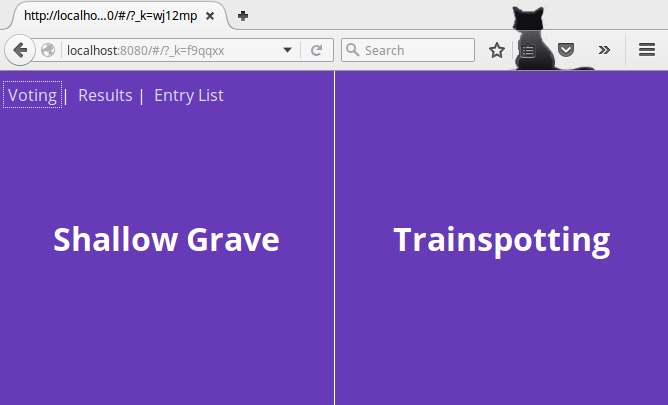
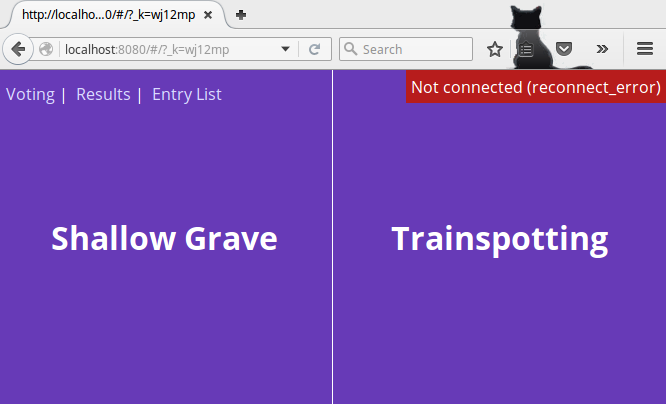
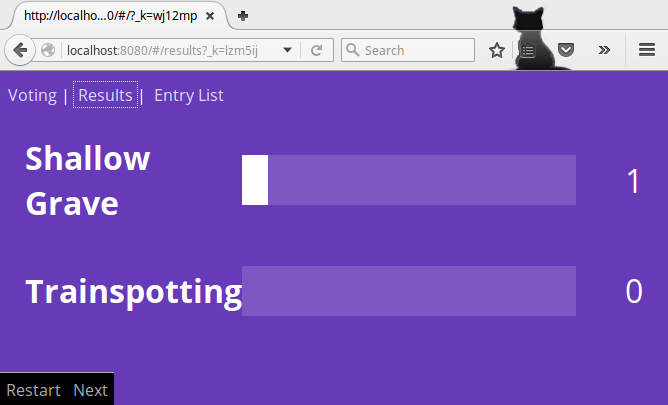
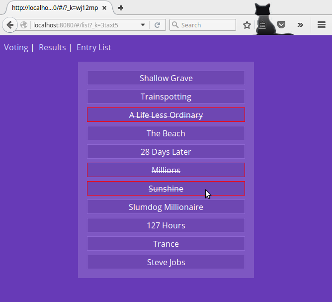

# VotingApp (updated)
voting react+redux app example from the excellent tutorial: http://teropa.info/blog/2015/09/10/full-stack-redux-tutorial.html

## Screenshots





## Changes
* package.json is updated to include the latest versions (using npm-check-updates)
* router logic is updated to the latest react-router conventions
* all exercises provided at the end of the tutorial are implemented
* some UI changes
* added a list page (and component) to list all the entries at once
* added links for voting, results, and list pages
* when an entry is clicked in the list page, it is striked out (implemented using server-side state)
* webpack will be installed locally
* switched deprecated autoprefixer with the postcss loader

## Instructions
```bash
cd voting-server; npm install; npm run start
cd voting-client; npm install; npm run start
```
note: "`npm run start2`" in server starts a nodemon server instead.
